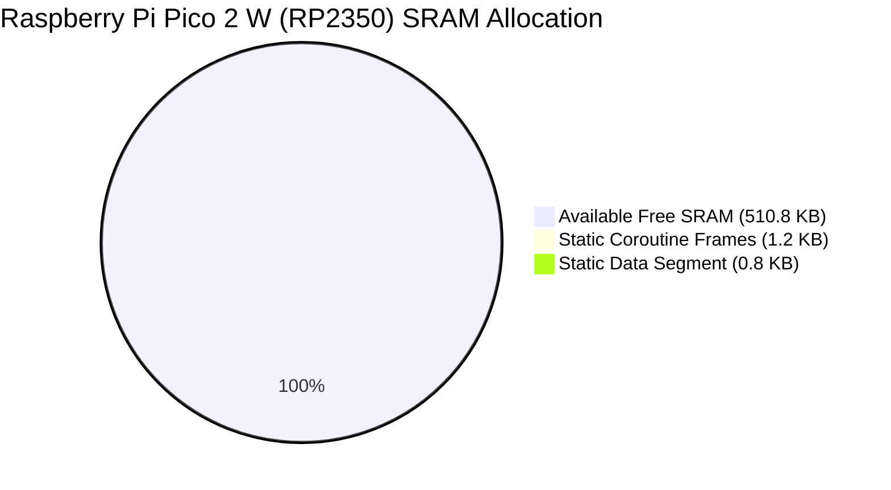

### 🤖 AbstractX SpecTrace Embedded Dashboard & Quality Gate

**Commit**: `4a25c32` (main) &bull; _fix: finalize E906 and Zynq integration review_

**Health Trend**: **STABLE** (All invariants and specifications preserved (100% parity).)

| Gate | Current Status | Trend vs Previous |
| :--- | :--- | :--- |
| **Specification Parity** | **25 / 25** (100.0%) | `+0.0%` |
| **Adversarial Invariants** | **9 / 9** [PASS] | `+0 tests` |
| **CppUTest SITL Mocks** | **12 tests (553 checks)** | 0 B Leaked |
| **Test Suite Runtime** | **222.6 ms** | `+1.1 ms` |
| **Inter-Core Latency (Pico 2)** | **8–12 cycles (53–80 ns)** | SIO FIFO Ring |
| **Dynamic Heap Budget** | **0 B (Compliant)** | Verified Freestanding |

> 📖 View the full running profile: [`docs/verification/RUNNING_PROFILE.md`](docs/verification/RUNNING_PROFILE.md)
